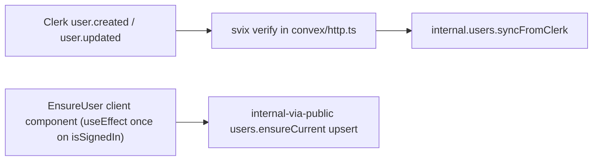

# Papamart MVP Build Plan

Keep the stack you already have ([package.json](package.json) confirms Next.js 16.2.6, React 19, Convex 1.39, Clerk v7, Tailwind v4) and add only what's needed. Functional correctness first; design pass is explicitly later.

## Architectural decisions

- **Backend**: Convex for all data (users, products, categories, cart, favourites, orders) + Convex storage for product images. Already wired via [components/ConvexProviderWithClerk.tsx](components/ConvexProviderWithClerk.tsx) and [convex/auth.config.ts](convex/auth.config.ts).
- **UI library**: shadcn/ui (Radix base, Tailwind v4). Initialize with `npx shadcn@latest init -d` so we get `components.json`, theme tokens in [app/globals.css](app/globals.css), and a populated `components/ui/`. Use the shadcn skill + MCP for every component install. Heavy use of `sidebar`, `data-table`, `dialog`, `sheet`, `form`, `input`, `select`, `card`, `button`, `badge`, `toast (sonner)`, `dropdown-menu`, `tabs`, `skeleton`.
- **Auth**: Clerk v7 (already installed). Public browse of products/categories/search/PDP; sign-in required for cart, favourites, onboarding, checkout, orders, account.
- **Onboarding (mandatory address)**: After sign-up, the user must land on `/onboarding` and submit a shipping address before checkout is reachable. Address lives on `users.address` in Convex and is verified in realtime via `useQuery(api.users.currentUser)` — checkout button is disabled until present, and `/checkout` server entry hard-redirects to `/onboarding?next=/checkout` if `address` is missing. The address check is **never** in `proxy.ts` (would deadlock the `/onboarding` route itself); it lives in the cart's `CheckoutGuard` client component and the `/checkout` Server Component.
- **Admin gating**: Clerk `publicMetadata.role === "admin"` set via Clerk CLI/dashboard. `proxy.ts` only enforces signed-in for `/admin/`*; the **actual role gate lives in [app/(admin)/admin/layout.tsx](app/(admin)**/admin/layout.tsx) which calls `fetchQuery(api.users.currentUser)` and redirects unless `role === "admin"`. Every Convex admin mutation re-checks `role === "admin"` from the caller's Convex `users` doc — defence in depth, no Clerk session-claim customization required.
- **Payments — hybrid via [@convex-dev/stripe](https://www.convex.dev/components/stripe)**: install the component to inherit signature-verified webhook scaffolding, automatic mirroring of Stripe data (`stripe.customers`, `stripe.payments`, `stripe.invoices`, `stripe.checkout_sessions`), and `getOrCreateCustomer` / customer-portal helpers. Because the component's built-in `createCheckoutSession` only supports a single `priceId + quantity` and our cart is multi-line, we mint the actual Checkout Session via the raw `stripe` SDK from inside a Convex `internalAction` (`convex/checkout.ts`). The component still handles the webhook signature + mirror; our domain logic plugs in via `registerRoutes(..., { events: { "checkout.session.completed": ..., "checkout.session.expired": ... } })`.
- **Membership**: Clerk Billing `<PricingTable />` for the free-shipping subscription stays in place — **not** the @convex-dev/stripe subscription path. The checkout flow's `auth().has({ feature: "free_shipping" })` is the single source of truth.
- **Checkout flow boundary (no public Convex surface for payment intent)**: `app/(client)/checkout/page.tsx` invokes `app/actions/checkout.ts` (`"use server"`). The Server Action runs `auth().has({ feature: "free_shipping" })` (trusted, server-side), then `fetchMutation(internal.orders.createPending, { hasFreeShipping })` (atomic stock reservation + address snapshot, returns `orderId`), then `fetchAction(internal.checkout.startStripeCheckout, { orderId })` which calls `stripeClient.getOrCreateCustomer(ctx, ...)` and then `stripe.checkout.sessions.create({ line_items, customer, mode: "payment", expires_at, metadata: { orderId } })`. Both Convex calls are **internal** — `hasFreeShipping` never crosses a public surface, and clients cannot forge their way past stock checks.
- **Inventory reservation (no oversell)**: `internal.orders.createPending` runs inside a single Convex mutation that, per cart line, reads `product.stock`, throws `INSUFFICIENT_STOCK` if `quantity > stock`, and decrements immediately. The order stores `reservedUntil = now + 30min`; the Stripe session is created with `expires_at = reservedUntil`. `checkout.session.expired` (handled in our `registerRoutes` events override) restores stock; `checkout.session.completed` only flips `pending → paid` and clears cart. A cron in `convex/crons.ts` sweeps any `pending` order past `reservedUntil` whose webhook never arrived and restores stock.
- **Webhook security**: handled by `@convex-dev/stripe`'s `registerRoutes` — it verifies signatures with `STRIPE_WEBHOOK_SECRET` before invoking any event handler, so we don't write that ourselves. Our event handlers are idempotent: lookup order by `stripeSessionId` and short-circuit on terminal status. Clerk webhook (separate concern) still verifies via `svix`'s `Webhook` (async, V8-safe).
- **Single currency**: One currency per deployment, pinned in env as `NEXT_PUBLIC_DEFAULT_CURRENCY` (e.g. `gbp`). All products are created in that currency; Stripe sessions use it unconditionally. Mixing currencies in one order would break Stripe, so we don't permit it.
- **Cart — Zustand + `persist` (localStorage), server-authoritative pricing**: the shopping cart lives entirely on the client in a Zustand store, persisted to localStorage via `zustand/middleware`'s `persist`. Schema is `{ userId: string | null, items: { productId, quantity }[] }`. Hydration is gated on a `hasMounted` flag to avoid Next.js SSR mismatch. A `<CartSync />` client component clears the store on three events: (a) sign-out, (b) Clerk user ID changes vs the persisted `userId`, (c) `checkout.session.completed` observed via `useQuery(api.orders.getBySessionId)` on `/checkout/success`. The cart UI hydrates display data through a Convex query `products.getManyByIds({ ids })` so price, stock, and "out of stock" remain reactive — but the Zustand store only stores IDs + quantities. At checkout, the Server Action forwards `items` to `internal.orders.createPending`, which **re-reads** `products.priceCents` and `products.stock` inside its Convex mutation transaction — the client can never forge a price or oversell. **Tradeoff**: cart is browser-local; no cross-device sync (acceptable MVP cut for simplicity).
- **Favourites — stays in Convex**: cross-device matters here (favourite on phone, buy on desktop), and the table is trivial. Not moving to Zustand.
- **Search**: Convex `searchIndex` on product `name`, filtered by `categoryId` + `isActive`.
- **Routing**: Two App Router groups — `app/(client)/...` and `app/(admin)/admin/...` — sharing the existing `app/layout.tsx`.

## Skills to invoke during implementation


| Phase                                      | Skill                                                                             |
| ------------------------------------------ | --------------------------------------------------------------------------------- |
| shadcn init, component add, theme          | `shadcn` skill + shadcn MCP (use for every `npx shadcn@latest add ...`)           |
| Schema, queries, mutations, indexes        | `convex-schema-builder`, `convex-function-creator`, `convex-quickstart` reference |
| Clerk role + Billing + middleware patterns | `clerk-nextjs-patterns`, `clerk-billing`, `clerk-custom-ui`, `clerk-webhooks`     |
| Stripe Checkout + webhook                  | `stripe-best-practices`, `stripe-projects`                                        |
| Final dev-server end-to-end check          | `verification` (Vercel skill)                                                     |


## Data model ([convex/schema.ts](convex/schema.ts))

```ts
addressValidator = v.object({
  fullName: v.string(),
  line1: v.string(),
  line2: v.optional(v.string()),
  city: v.string(),
  region: v.string(),         // state / county
  postalCode: v.string(),
  country: v.string(),        // ISO-3166 alpha-2
  phone: v.optional(v.string()),
})

users: {
  clerkUserId, email, name?, imageUrl?,
  role?: v.literal("admin"),
  stripeCustomerId?,
  address?: addressValidator, // <-- onboarding writes this; checkout requires it
  createdAt
}
  index by_clerk_user_id

categories: { name, slug, imageStorageId?, sortOrder }
  index by_slug, by_sortOrder

products: { name, slug, description, priceCents, currency, categoryId, imageStorageId?, stock, unit, isActive, createdAt }
  index by_slug, by_category, by_active
  searchIndex search_name on name with filter categoryId, isActive

// No cartItems table — cart lives in Zustand + localStorage on the client.

favorites: { userId, productId, createdAt }
  index by_user, by_user_and_product

orders: {
  userId, status: "pending"|"paid"|"fulfilled"|"cancelled",
  stripeSessionId?, stripePaymentIntentId?,
  subtotalCents, shippingCents, totalCents, currency,
  hadFreeShipping,
  shippingAddress: addressValidator, // snapshot at order time
  reservedUntil?: number,            // ms epoch; for stock-reservation sweep
  createdAt
}
  index by_user, by_status, by_stripe_session, by_reservedUntil

orderItems: { orderId, productId, nameSnapshot, priceCentsSnapshot, quantity }
  index by_order
```

All public functions validate args + check `ctx.auth.getUserIdentity()`; admin functions also verify the caller's Convex user has `role === "admin"`. Order creation re-reads `users.address` server-side and refuses if missing — never trust a client-passed address.

## File layout

```
components.json                   # NEW - shadcn config (created by `npx shadcn@latest init -d`)
proxy.ts                          # update: public routes + auth routes + admin gating
convex/
  convex.config.ts                # NEW - registers @convex-dev/stripe component
  schema.ts
  users.ts                        # currentUser, ensureCurrent, setAddress, syncFromClerk(internal)
  categories.ts                   # list, getBySlug
  products.ts                     # list, getBySlug, byCategory, search, getManyByIds
                                  #   (used by cart UI for live hydration of Zustand items)
  favorites.ts                    # listMine, toggle, isFavorited
  orders.ts                       # listMine, getMine; internal: createPending,
                                  #   markPaid, cancelExpired, expireStale (cron target)
  checkout.ts                     # NEW - internalAction startStripeCheckout:
                                  #   stripeClient.getOrCreateCustomer + stripe.checkout.sessions.create
                                  #   (multi-line line_items, expires_at, metadata.orderId)
  crons.ts                        # NEW - every 5 min: internal.orders.expireStale
  http.ts                         # registerRoutes(stripe component) with custom events for
                                  #   checkout.session.completed / .expired + svix-verified
                                  #   Clerk webhook for users
  admin/products.ts               # create, update, delete, setStock, generateUploadUrl
  admin/categories.ts             # create, update, delete
  admin/orders.ts                 # listAll, updateStatus
  admin/customers.ts              # listAll
app/actions/
  checkout.ts                     # NEW - "use server" Server Action: auth().has() +
                                  #   fetchMutation(internal.orders.createPending) +
                                  #   fetchAction(internal.checkout.startStripeCheckout)
lib/
  cart-store.ts                   # NEW - Zustand store with persist middleware
                                  #   { userId, items[], addItem, removeItem,
                                  #     setQuantity, clear, hasMounted }
components/
  ui/                             # shadcn components (button, input, card, dialog, sheet,
                                  #   sidebar, data-table, form, select, badge, toast, etc.)
  client/{Header,ProductCard,CategoryCard,AddToCartButton,FavoriteButton,
          CartLine,Price,AddressForm,CheckoutGuard,CartSync}.tsx
                                  # CartSync clears the store on sign-out / Clerk user
                                  # change / paid order observation
  admin/{AppSidebar,AdminShell,ProductForm,CategoryForm,OrderStatusSelect,
         ProductsTable,OrdersTable,CustomersTable}.tsx
app/(client)/
  layout.tsx                      # shadcn Header (logo, command-menu search, cart Sheet,
                                  #   UserButton) + Footer
  page.tsx                        # Home: hero + category grid + featured products
  categories/[slug]/page.tsx
  products/[slug]/page.tsx        # PDP: image, price, stock, add-to-cart, favourite
  search/page.tsx
  cart/page.tsx                   # CheckoutGuard hides "Proceed" if no address
  onboarding/page.tsx             # NEW - AddressForm, redirects to ?next= when saved
  checkout/page.tsx               # server: requires address, else redirect to /onboarding
  checkout/success/page.tsx
  favourites/page.tsx
  orders/page.tsx
  orders/[id]/page.tsx
  membership/page.tsx             # <PricingTable />
app/(admin)/admin/
  layout.tsx                      # shadcn SidebarProvider + AppSidebar (mobile-responsive)
                                  #   + role gate (redirect if not admin)
  page.tsx                        # dashboard (cards + recent orders table)
  products/page.tsx + new + [id]  # DataTable + ProductForm in Sheet/Dialog
  categories/page.tsx
  orders/page.tsx + [id]
  customers/page.tsx
```

## Flow diagrams

```mermaid
flowchart LR
  Browse[Browse PDP] -->|addItem| Zustand["Zustand cart store (localStorage)"]
  Zustand --> CartUI["/cart page"]
  CartUI -->|useQuery products.getManyByIds| LivePrices[Live price + stock hydration]
  CartUI --> CheckoutPage[checkout/page.tsx server]
  CheckoutPage --> AddrCheck{"users.address exists?"}
  AddrCheck -- no --> Onboard["/onboarding?next=/checkout"]
  Onboard -->|users.setAddress mutation| AddrCheck
  AddrCheck -- yes --> ServerAction["app/actions/checkout.ts (Server Action)"]
  ServerAction --> HasFree["auth().has(free_shipping) - trusted"]
  HasFree --> CreatePending["internal.orders.createPending - re-reads prices/stock, reserves, snapshots address"]
  CreatePending --> StartCheckout["internal.checkout.startStripeCheckout"]
  StartCheckout --> GetCust["stripeClient.getOrCreateCustomer (component)"]
  GetCust --> StripeSDK["stripe.checkout.sessions.create (multi-line, expires_at, metadata.orderId)"]
  StripeSDK --> Redirect[Redirect to Stripe Checkout]
  Redirect -->|webhook| RegRoutes["registerRoutes /stripe/webhook (verified by @convex-dev/stripe)"]
  RegRoutes -->|component default| Mirror["mirrors customer / payment / invoice into stripe.* tables"]
  RegRoutes -->|events override completed| MarkPaid["internal.orders.markPaid"]
  RegRoutes -->|events override expired or cron| Restore["internal.orders.cancelExpired - restore stock"]
  Redirect -->|success_url| SuccessPage[checkout/success]
  SuccessPage -->|observes order.status = paid via useQuery| ClearCart[cartStore.clear]
```







The cart page's "Proceed to Checkout" button is reactively disabled via `useQuery(api.users.currentUser)` whenever `address` is falsy. A small `<EnsureUser />` client component sits in `(client)/layout.tsx` and calls `useMutation(api.users.ensureCurrent)` once when `isSignedIn` flips true — webhook-backstop for first-time sign-ins without re-running on every render.

## Phase breakdown

1. **Foundation** — `pnpm add @convex-dev/stripe stripe svix react-hook-form zod @hookform/resolvers`; `npx shadcn@latest init -d` (will overwrite [app/globals.css](app/globals.css) — re-add the Geist font binding afterward); add core components (`button input card sheet dialog form select label badge sonner dropdown-menu skeleton command tabs separator avatar alert sidebar table breadcrumb`); mount `<Toaster />` in `app/layout.tsx`; create `convex/convex.config.ts` registering the stripe component; Convex `schema.ts` incl. `users.address` + `orders.reservedUntil`; Clerk webhook in `convex/http.ts` (svix-verified) for user sync + `<EnsureUser />` client backstop; update [proxy.ts](proxy.ts) — public for `/`, `/categories(.*)`, `/products(.*)`, `/search`, `/membership`; auth required for `/cart`, `/checkout(.*)`, `/orders(.*)`, `/favourites`, `/onboarding`, `/admin(.*)`; **no** address or role checks in `proxy.ts`; shared `(client)/layout.tsx` with shadcn Header.
2. **Catalog** — categories + products Convex tables, currency pinned to `process.env.NEXT_PUBLIC_DEFAULT_CURRENCY` on every product write, seed script (`convex/seed.ts` as internal mutation), category browse page, PDP, search page powered by Convex `searchIndex`. UI uses shadcn `Card`, `Badge`, `Skeleton`, `Input`.
3. **Cart + Favourites** — `pnpm add zustand`; create [lib/cart-store.ts](lib/cart-store.ts) with `persist` middleware (localStorage key `papamart-cart`); render-gate via `hasMounted` to avoid SSR hydration mismatch; `<CartSync />` mounted in `(client)/layout.tsx` clears the store on sign-out, on Clerk user change, and on observing a paid order for the most recent session id. Cart hydration uses a new `products.getManyByIds` query so price/stock/availability are live and reactive. Header cart badge reads `useCartStore(state => state.items.length)` after mount. Cart page uses shadcn `Table` rows + `Sheet` for mobile. **Favourites stay Convex-backed** (cross-device matters) — `favorites.toggle/listMine/isFavorited` queries + mutations.
4. **Onboarding (address)** — `AddressForm` built with shadcn `Form` + `react-hook-form` + `zod`; `users.setAddress` mutation; `/onboarding` page handles `?next=` redirect; `CheckoutGuard` client component disables the Proceed button reactively when `currentUser.address` is missing; cart's no-address state surfaced with shadcn `Alert` linking to `/onboarding`.
5. **Checkout + Orders** — `app/(client)/checkout/page.tsx` is a Server Component that calls `fetchQuery(api.users.currentUser, ...)` and `redirect("/onboarding?next=/checkout")` if `address` is missing. The Proceed button (client) reads `useCartStore` and passes `items: [{ productId, quantity }]` into the Server Action. `app/actions/checkout.ts` (`"use server"`): reads `auth().has({ feature: "free_shipping" })`, calls `fetchMutation(internal.orders.createPending, { items, hasFreeShipping })` which **re-reads each product server-side for price + stock**, atomically reserves stock per line (throws `INSUFFICIENT_STOCK` on any over-cart), snapshots address + line items, sets `reservedUntil`, returns `orderId`. The Server Action then calls `fetchAction(internal.checkout.startStripeCheckout, { orderId })` which uses `stripeClient.getOrCreateCustomer(ctx, ...)` from `@convex-dev/stripe` then calls `stripe.checkout.sessions.create({ line_items, customer, mode: "payment", expires_at, success_url: ".../checkout/success?session_id={CHECKOUT_SESSION_ID}", cancel_url, metadata: { orderId } })` and returns the URL. `convex/http.ts` mounts `registerRoutes(http, components.stripe, { webhookPath: "/stripe/webhook", events: { "checkout.session.completed": ..., "checkout.session.expired": ... } })` — the component verifies signatures and mirrors data into `stripe.*` tables, our custom events call `internal.orders.markPaid` / `cancelExpired`. `convex/crons.ts` runs `internal.orders.expireStale` every 5 min as a safety net. `/checkout/success` reads `session_id` and runs `useQuery(api.orders.getBySessionId, { sessionId })`; once `status === "paid"` it calls `cartStore.clear()` and shows the receipt + link to `/orders/[id]`. `/orders` + `/orders/[id]` show history; `/orders/[id]` can also display mirrored payment status via the component's `listPaymentsByUserId` query.
6. **Membership** — `<PricingTable />` on `/membership`; Clerk Billing feature key `free_shipping` (kept on Clerk Billing — not on @convex-dev/stripe's subscription path). Server Action sets `shippingCents = 0` and `hadFreeShipping = true` when `has()` returns true; the boolean enters Convex only through `internalMutation` args, never public.
7. **Admin panel** — `proxy.ts` only requires sign-in on `/admin/`*. The actual role gate is in `app/(admin)/admin/layout.tsx`: `fetchQuery(api.users.currentUser)` and `redirect("/")` unless `role === "admin"`. Layout uses shadcn `SidebarProvider` + `AppSidebar` (mobile responsive out of the box) + breadcrumb header. Dashboard cards, products `DataTable` with `Sheet`-based create/edit using `ProductForm`, image upload via Convex `generateUploadUrl`, categories CRUD, orders list/detail with shadcn `Select` status updates, customers list. Every admin mutation re-verifies `role === "admin"` from the caller's Convex `users` doc.
8. **Polish & verify** — `pnpm lint`, `pnpm build`, `npx convex dev`, manual end-to-end: anonymous browse → sign up → forced onboarding → save address → add to cart → favourite → checkout (with and without membership) → order appears in admin → mark fulfilled → stock decremented on PDP → simulate `checkout.session.expired` via Stripe CLI to confirm stock restoration.

## Environment variables (already partially present in `.env.local`)

- `NEXT_PUBLIC_CONVEX_URL`, `CLERK_PUBLISHABLE_KEY`, `CLERK_SECRET_KEY`, `CLERK_FRONTEND_API_URL` (existing)
- Add to `.env.local`: `NEXT_PUBLIC_APP_URL`, `NEXT_PUBLIC_DEFAULT_CURRENCY` (e.g. `gbp`). No `STRIPE_SECRET_KEY` here — the Stripe SDK call lives in a Convex action, so the secret stays on the Convex deployment.
- Add to Convex via `npx convex env set ...`: `STRIPE_SECRET_KEY`, `STRIPE_WEBHOOK_SECRET` (both read by `@convex-dev/stripe`), `CLERK_WEBHOOK_SIGNING_SECRET`.
- New runtime deps: `@convex-dev/stripe`, `stripe`, `svix`, `zustand`, `react-hook-form`, `zod`, `@hookform/resolvers` (added via `pnpm add`).
- Stripe webhook endpoint URL: `https://<convex-deployment>.convex.site/stripe/webhook` (added in Stripe Dashboard with the 12 events listed in §6 of the component's quick-start).

## Out of scope (MVP cut)

- Multiple sellers / Stripe Connect (single-store)
- Reviews / ratings
- Promo codes / discount engine
- Multiple saved addresses / address book (single `users.address`; can extend to an `addresses` table later without breaking orders since they snapshot the address)
- Cross-device cart sync (cart is browser-local via Zustand + localStorage by design — favourites and orders are cross-device via Convex)
- Email notifications (Stripe sends receipts; richer email later via Clerk/Resend)
- Custom design pass / brand theme (shadcn defaults stay until functionality is locked)

